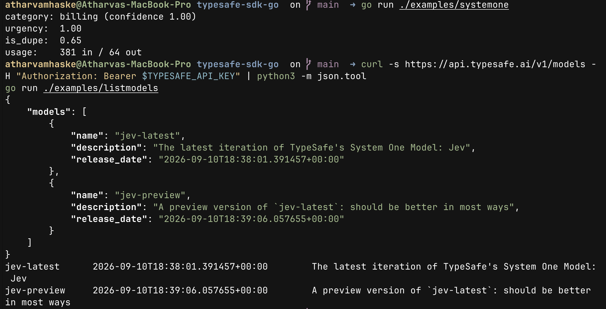

# typesafe-sdk-go

[](https://github.com/atharvamhaske/typesafe-sdk-go/actions/workflows/ci.yml)
[](https://pkg.go.dev/github.com/atharvamhaske/typesafe-sdk-go)
[](https://typesafe-sdk-go.mintlify.site/)
[](./LICENSE)

An unofficial Go SDK for [TypeSafe](https://typesafe.ai). Full docs: **[typesafe-sdk-go.mintlify.site](https://typesafe-sdk-go.mintlify.site/)**.

`typesafe-sdk-go` gives Go applications access to the same `SystemOne` question-answering workflow that exists in the official Python and JavaScript SDKs: typed choice, score, and noul questions, a typed answer union, and model discovery.

## Why This Exists

TypeSafe ships official SDKs for Python and JavaScript, but there is no first-class Go SDK today. This project fills that gap with a Go-native client, built to the same wire contract as the other two.

This project is unofficial and is not affiliated with or endorsed by TypeSafe. If an official Go SDK lands upstream, this repo should ideally become unnecessary.

## Status

This project is in **beta**.

- Both API endpoints (`/v1/systemone`, `/v1/models`) are implemented.
- `go test ./...` passes against local fixtures with no network access.
- A live test (`live_test.go`) is verified against the real API and runs in CI when `TYPESAFE_API_KEY` is set.
- The SDK is checked against the upstream OpenAPI spec, committed at [openapi.json](openapi.json).

## Requirements

- Go 1.21+
- A TypeSafe API key

## Installation

```bash
go get github.com/atharvamhaske/typesafe-sdk-go
```

See the [quickstart](https://typesafe-sdk-go.mintlify.site/quickstart) for a walkthrough.

## Quickstart

```bash
export TYPESAFE_API_KEY=sk-...
```

```go
package main

import (
	"context"
	"fmt"
	"log"

	typesafe "github.com/atharvamhaske/typesafe-sdk-go"
)

func main() {
	client, err := typesafe.NewClient() // reads TYPESAFE_API_KEY
	if err != nil {
		log.Fatal(err)
	}

	resp, err := client.SystemOne(context.Background(),
		"I was charged twice. Please refund the duplicate charge today.",
		map[string]typesafe.Question{
			"category": typesafe.Choice{
				Instructions: "Categorize the message",
				Criteria:     map[string]string{"billing": "Billing issue", "technical": "Technical issue"},
			},
			"urgency": typesafe.Score{
				Instructions: "Rate urgency",
				Criteria:     []string{"Can wait", "Needs attention"},
			},
			"is_dupe": typesafe.Noul{
				Instructions: "Is this a duplicate charge?",
				Criteria:     map[string]string{"true": "Duplicate", "false": "Not a duplicate"},
			},
		})
	if err != nil {
		log.Fatal(err)
	}

	fmt.Println(resp.Choices()["category"].Choice) // "billing"
	fmt.Println(resp.Scores()["urgency"].Score)    // 1.7
	fmt.Println(resp.Nouls()["is_dupe"].Noul)      // 0.98
}
```

## Feature Coverage

### SystemOne

- Typed `Choice`, `Score`, and `Noul` question builders
- Typed answer union, decoded from the API's discriminated response
- Per-call model override with `WithRequestModel`
- Token usage on every response

### Models

- List available models with `ListModels`

## Package Overview

For full API documentation, see the [docs site](https://typesafe-sdk-go.mintlify.site/api-reference), [api.md](api.md), or [pkg.go.dev](https://pkg.go.dev/github.com/atharvamhaske/typesafe-sdk-go).

The public surface is organized around one handle:

- `Client` for both `SystemOne` and `ListModels`, configured with functional options

## Configuration

| Option | Env var | Purpose |
| --- | --- | --- |
| `WithAPIKey` | `TYPESAFE_API_KEY` | API key, required |
| `WithBaseURL` | `TYPESAFE_BASE_URL` | API base URL, defaults to `https://api.typesafe.ai` |
| `WithModel` | `TYPESAFE_DEFAULT_MODEL` | Default model, defaults to `jev-latest` |
| `WithHTTPClient` | — | Underlying `*http.Client` |

## Error Handling

Non-2xx responses return `*typesafe.Error`:

| Field | Purpose |
| --- | --- |
| `StatusCode` | HTTP status code |
| `Detail` | Validation detail, when the API returns one |
| `Body` | Raw response body |

## Examples

Runnable examples live in [examples/](examples/) and are walked through on the [examples page](https://typesafe-sdk-go.mintlify.site/examples):

```bash
TYPESAFE_API_KEY=... go run ./examples/systemone
TYPESAFE_API_KEY=... go run ./examples/listmodels
TYPESAFE_API_KEY=... go run ./examples/spamfilter   # Noul spam/moderation classifier
TYPESAFE_API_KEY=... go run ./examples/prlabel      # Choice-based PR/diff labeler
TYPESAFE_API_KEY=... go run ./examples/gamemove     # Choice-based game move picker
```

## Verified Against the Live API

The raw endpoint via curl:

```console
$ curl -s https://api.typesafe.ai/v1/systemone \
    -H "Authorization: Bearer $TYPESAFE_API_KEY" \
    -H "Content-Type: application/json" \
    -d '{"state":"I was charged twice. Please refund the duplicate charge today.",
         "model":"jev-latest",
         "questions":{"category":{"type":"choice","instructions":"Categorize the message",
           "criteria":{"billing":"Billing issue","technical":"Technical issue"}}}}'
{
  "model": "jev-1.13.0",
  "answers": {
    "category": {
      "type": "choice",
      "choice": "billing",
      "confidence": 1.0,
      "probabilities": {"billing": 1.0, "technical": 0.0}
    }
  },
  "usage": {"input_tokens": 319, "output_tokens": 31}
}
```

The same call through the SDK:

```console
$ TYPESAFE_API_KEY=... go run ./examples/systemone
category: billing (confidence 1.00)
urgency:  1.00
is_dupe:  0.66
usage:    381 in / 64 out
```



## Use with Braintrust

[`trace/contrib/typesafe`](https://github.com/atharvamhaske/braintrust-sdk-go/tree/feat/typesafe-tracing/trace/contrib/typesafe) automatically traces every `SystemOne` call through `typesafe.WithHTTPClient`, matching the span shape the official Python and JS TypeSafe integrations use. It is not merged upstream yet, so install it from the fork branch:

```bash
go get github.com/atharvamhaske/braintrust-sdk-go/trace/contrib/typesafe@feat/typesafe-tracing
```

See the [Use with Braintrust](https://typesafe-sdk-go.mintlify.site/use-with-braintrust) docs page for the field reference, and [examples/braintrust](examples/braintrust) for a full runnable example. That example has its own `go.mod`, so `braintrust-sdk-go` and OpenTelemetry stay out of the core SDK's dependency graph.

```bash
cd examples/braintrust
BRAINTRUST_API_KEY=... TYPESAFE_API_KEY=... go run .
```

## Testing

```bash
go test ./...                                    # fixture tests, no network
TYPESAFE_API_KEY=... go test ./...               # includes the live API test
```

## Contributing

Issues and pull requests are welcome. See [CONTRIBUTING.md](CONTRIBUTING.md).

If you want to extend surface area or align behavior with the upstream SDKs, opening an issue first is helpful so the API shape can stay coherent.

## Relationship to Upstream

This repository exists because there is no official Go SDK at the time of writing. If the TypeSafe team decides to ship or adopt one upstream, aligning this project with that effort would be the best long-term outcome.

## References

- [TypeSafe documentation](https://docs.typesafe.ai)
- [Official JavaScript SDK](https://github.com/typesafe-ai/typesafe-sdk-js)
- [Official Python SDK](https://github.com/typesafe-ai/typesafe-sdk-python)
- [TypeSafe OpenAPI specification](https://api.typesafe.ai/openapi.json), also committed at [openapi.json](openapi.json)

## License

MIT. See [LICENSE](LICENSE).
